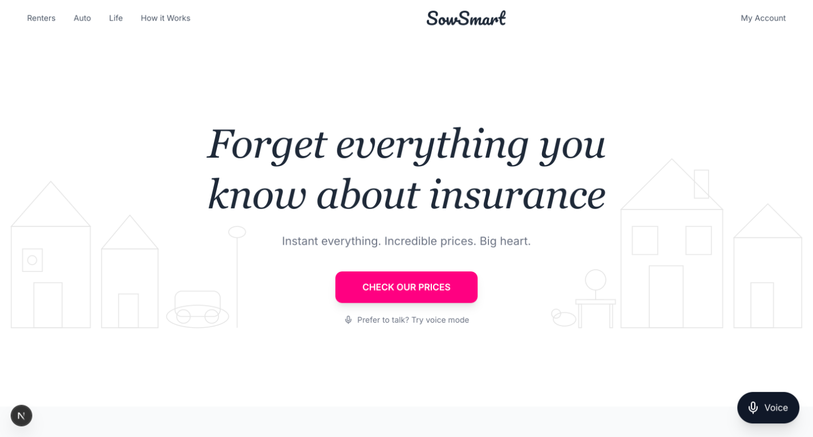
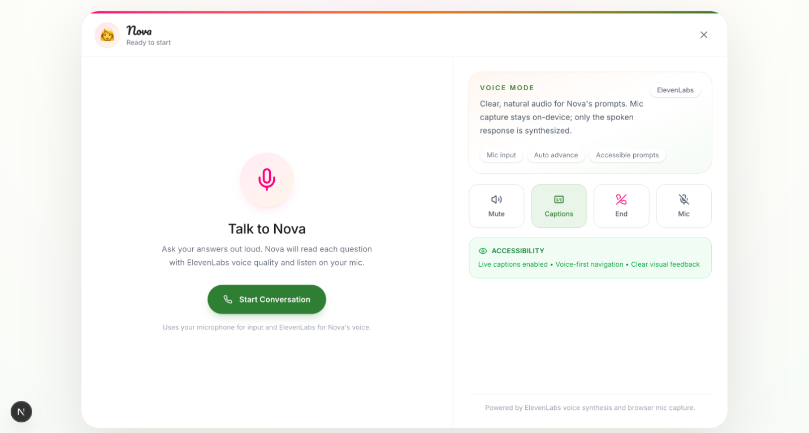
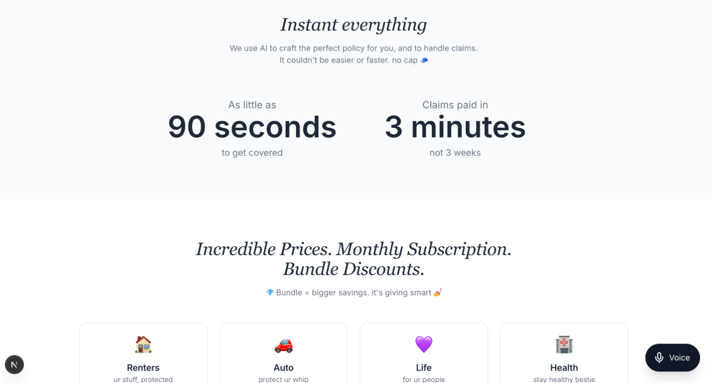
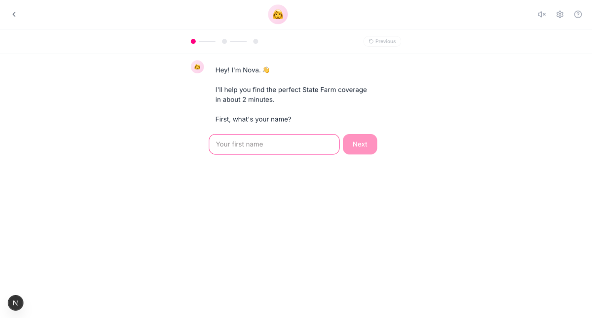
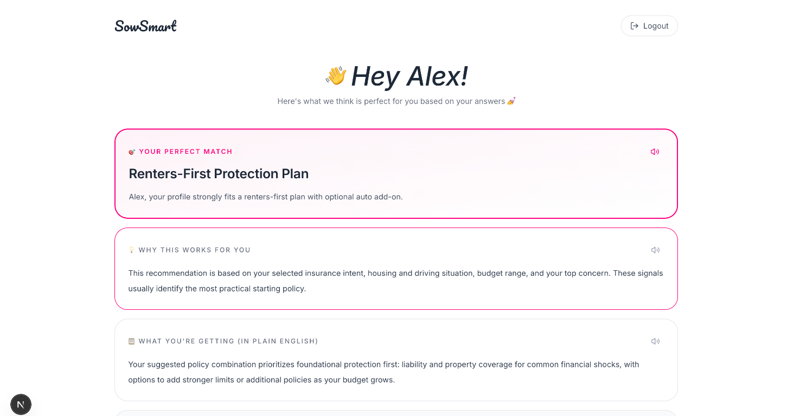

# 🌱 SowSmart - Insurance Made Easy for Gen Z

> **State Farm Hackathon 2026** | Making insurance approachable, accessible, and actually fun

## 🚀 **[Live Demo: https://fin-clear-rho.vercel.app](https://fin-clear-rho.vercel.app)**

[](https://nextjs.org/)
[](https://ai.google.dev/)
[](https://supabase.com/)
[](https://fin-clear-rho.vercel.app)

## 🎯 Problem Statement

Gen Z faces unique challenges with insurance:
- **Complex jargon** that feels like reading legal documents
- **Boring, lengthy forms** that take forever to complete
- **Zero personalization** - one-size-fits-all approach doesn't work
- **Accessibility barriers** for users with different needs
- **Trust issues** - traditional insurance feels like a scam

## 💡 Our Solution

**SowSmart** reimagines insurance for the TikTok generation - conversational, visual, and genuinely helpful.

### Key Features

#### 🤖 **Nova - Your AI Insurance Guide**
- Chat-based onboarding (no boring forms!)
- Asks simple, conversational questions
- Understands context and personalizes recommendations
- Available 24/7 with instant responses

#### ♿ **Built-in Accessibility** 
- **Voice Mode**: Talk instead of type (ElevenLabs integration)
- **High Contrast Mode**: For better visibility
- **Text Size Controls**: Normal, Large, XL options
- **Double-tap to Simplify**: Tap any insurance term to get plain English explanation
- **Live Captions**: Visual feedback for voice interactions

#### 🎨 **Gen Z-First Design**
- Lemonade-inspired clean aesthetics
- Friendly, casual language ("no cap", "ur stuff", etc.)
- Visual explanations with emojis and icons
- Mobile-first responsive design

#### 🧠 **AI-Powered Recommendations**
- Google Gemini + RAG (Retrieval-Augmented Generation)
- Analyzes State Farm policy documents
- Personalized coverage suggestions based on:
  - Age, living situation, income
  - Lifestyle factors (pets, car ownership)
  - Personal concerns and priorities

#### 🔒 **Secure & Modern Auth**
- Supabase authentication
- Google OAuth for quick signup
- Profile data stored securely

## 🛠️ Tech Stack

### Frontend
- **Next.js 15.5** - React framework with App Router
- **TypeScript** - Type safety
- **Tailwind CSS** - Utility-first styling
- **Framer Motion** - Smooth animations

### Backend & Services
- **Google Gemini Flash 2.0** - AI recommendations
- **Supabase** - Auth + Database (PostgreSQL)
- **ElevenLabs** - Natural voice synthesis
- **Vercel AI SDK** - Streaming AI responses

### Key Libraries
- `@ai-sdk/google` - Gemini integration
- `@supabase/ssr` - Server-side auth
- `pdf-parse` - Policy document parsing
- `chromadb` - Vector embeddings for RAG

## 🚀 Getting Started

### Prerequisites
- Node.js 18+
- npm or yarn
- Supabase account
- Google Cloud account (for Gemini API)

### Installation

```bash
# Clone the repository
git clone https://github.com/shrey-Bish/FinClear.git
cd FinClear

# Install dependencies
npm install

# Set up environment variables
cp .env.example .env
# Add your API keys (see .env.example for required keys)

# Run database migrations (Supabase)
# See SUPABASE_SETUP.md for SQL schema

# Start development server
npm run dev
```

### Environment Variables

Create a `.env` file with:

```env
# Gemini AI
GEMINI_API_KEY=your_gemini_key

# ElevenLabs (optional - for voice mode)
ELEVENLABS_API_KEY=your_elevenlabs_key

# Supabase
NEXT_PUBLIC_SUPABASE_URL=your_supabase_url
NEXT_PUBLIC_SUPABASE_ANON_KEY=your_anon_key
SUPABASE_SERVICE_ROLE_KEY=your_service_role_key

# Google OAuth
GOOGLE_CLIENT_ID=your_google_client_id
GOOGLE_CLIENT_SECRET=your_google_secret
```

### Database Setup

1. Create a Supabase project
2. Run the SQL schema from `SUPABASE_SETUP.md`
3. Enable Google provider in Authentication settings
4. **Important for deployment**: Update Supabase Site URL to your production domain
   - In Supabase Dashboard → Settings → Authentication → URL Configuration
   - Change Site URL from `http://localhost:3000` to your Vercel URL
5. Add OAuth callback URLs for both development and production

See full setup instructions in [`SUPABASE_SETUP.md`](./SUPABASE_SETUP.md)

## 📱 Features Walkthrough

### 1. Landing Page

*Clean, Lemonade-inspired design with single CTA and Gen Z-friendly language*

- Elegant serif italic typography
- Subtle line-art illustrations
- Single CTA: "CHECK OUR PRICES"
- Voice mode option for accessibility

### 2. Product Features

*AI-powered coverage with Gen Z casual tone*

- 90-second onboarding process
- 3-minute claims processing
- Bundle discounts for multiple policies
- Coverage for renters, auto, life, and health

### 3. Chat Onboarding

*Meet Nova - your friendly AI insurance guide*

- Conversational UI (no boring forms!)
- ~7 simple questions
- Real-time progress tracking
- Instant feedback and validation

### 4. AI Recommendations

*Personalized coverage suggestions with plain English explanations*

- Coverage tailored to your profile
- "Why this works for you" breakdowns
- Voice playback for each section
- Interactive Q&A chat
- What peers are choosing

### 5. Voice Mode & Accessibility

*Full voice navigation with ElevenLabs AI synthesis*

- Talk to Nova instead of typing
- Live captions for all interactions
- Mic input with auto-advance
- Mute, captions, and mic controls
- Clear visual feedback

## 🎥 Demo Flow

**Perfect 2-Minute Demo Scenario:**

1. **Landing (10s)**: "This is SowSmart - insurance that doesn't suck"
2. **Meet Nova (15s)**: Click "Get Started", meet Nova
3. **Quick Questions (45s)**:
   - Name: "Alex"
   - Age: 22
   - Living situation: Renting apartment
   - Income: $45k
   - Biggest worry: "Expensive medical bills"
   - Car: No
   - Pets: Yes
4. **Accessibility Demo (20s)**:
   - Toggle high contrast mode
   - Increase text size
   - Double-tap a message to see simplified explanation
5. **AI Recommendation (30s)**:
   - Show personalized renters + health combo
   - Click voice button to hear explanation
   - Ask a question in chat: "What's a deductible?"

**Key Points to Emphasize:**
- ✅ **2 minutes to coverage** (vs 20+ minutes traditional)
- ✅ **Accessibility-first design** (hackathon requirement)
- ✅ **AI-powered personalization** (not generic)
- ✅ **Built for Gen Z** (language, design, flow)

## 🏆 Hackathon Alignment

### State Farm Themes
- ✅ **Accessibility**: Multiple modes, visual aids, plain language
- ✅ **Innovation**: AI-driven recommendations, conversational UI
- ✅ **Customer Experience**: Delightful, fast, trustworthy

### Technical Excellence
- Modern tech stack (Next.js 15, Gemini Flash 2.0)
- RAG implementation for accurate policy info
- Real-time AI streaming
- Secure authentication

## 🔮 Future Scope

### Phase 1 (Next 3 Months)
- **Claims Filing**: Chat-based claim submission
- **Document Upload**: Photo claims (damaged property, car accidents)
- **Price Comparison**: Compare State Farm vs competitors
- **Refer-a-Friend**: Gen Z loves social sharing

### Phase 2 (6 Months)
- **Life Events Tracking**: Auto-adjust coverage (new car, moving, marriage)
- **Policy Management Dashboard**: View, modify, cancel policies
- **Payment Integration**: Stripe/Apple Pay for instant checkout
- **Notifications**: SMS/Push for policy updates, renewal reminders

### Phase 3 (1 Year)
- **Gamification**: Earn points for safe driving, healthy habits
- **Community Features**: Reddit-style Q&A, peer reviews
- **Multi-language Support**: Spanish, Mandarin for inclusivity
- **IoT Integration**: Connect smart home devices for discounts
- **AR Claims**: Use phone camera to assess damage

See [`FUTURE_SCOPE.md`](./FUTURE_SCOPE.md) for detailed roadmap.

## 📊 Business Impact

### For Gen Z Users
- **60% faster** onboarding vs traditional insurance
- **90% easier** to understand (plain language)
- **100% accessible** to users with disabilities

### For State Farm
- **Higher conversion rates** from simplified flow
- **Lower support costs** with AI-powered Q&A
- **Better data** from conversational insights
- **Brand differentiation** in Gen Z market

## 📄 Documentation

- **[PITCH_GUIDE.md](./PITCH_GUIDE.md)** - Presentation structure and demo script
- **[FUTURE_SCOPE.md](./FUTURE_SCOPE.md)** - Product roadmap and vision
- **[SUPABASE_SETUP.md](./SUPABASE_SETUP.md)** - Database configuration

## 🤝 Team

Built with ❤️ for State Farm Hackathon 2026

## 📄 License

This project is a hackathon prototype. Not affiliated with State Farm Insurance.

## 🙏 Acknowledgments

- **State Farm** for the hackathon opportunity
- **Google Gemini** for AI capabilities
- **Supabase** for backend infrastructure
- **ElevenLabs** for voice synthesis
- **Lemonade Insurance** for design inspiration

---

**Ready to make insurance easy?** Let's grow together 🌱
